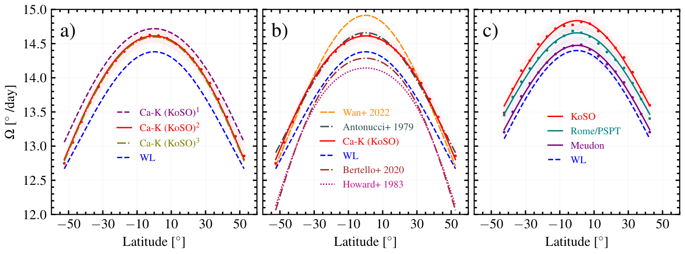

# Differential Rotation of the Solar Chromosphere: A Century-long Perspective from Kodaikanal Solar Observatory Ca II K Data

**Authors:** Dibya Kirti Mishra, Srinjana Routh, Bibhuti Kumar Jha, Theodosios Chatzistergos, Judhajeet Basu, Subhamoy Chatterjee, Dipankar Banerjee, Ilaria Ermolli

[](https://iopscience.iop.org/article/10.3847/1538-4357/ad1188/meta)

## Abstract

<p align="justify">
Chromospheric differential rotation is a key component in comprehending the atmospheric coupling between the chromosphere and the photosphere at different phases of the solar cycle. In this study, we therefore utilize the newly calibrated multidecadal Ca II K spectroheliograms (1907-2007) from the Kodaikanal Solar Observatory (KoSO) to investigate the differential rotation of the solar chromosphere using the technique of image cross-correlation. Our analysis yields the chromospheric differential rotation rate Ω(θ) = (14.61 ± 0.04 - 2.18 ± 0.37 sin²θ - 1.10 ± 0.61 sin⁴θ)° day⁻¹. These results suggest the chromospheric plages exhibit an equatorial rotation rate 1.59% faster than the photosphere when compared with the differential rotation rate measured using sunspots and also a smaller latitudinal gradient compared to the same. To compare our results to those from other observatories, we have applied our method on a small sample of Ca II K data from Rome, Meudon, and Mt. Wilson observatories, which support our findings from KoSO data. Additionally, we have not found any significant north-south asymmetry or any systematic variation in chromospheric differential rotation over the last century.
</p>

## Data and code

| File | Description |
| :--- | :--- |
| [`method_figures.ipynb`](method_figures.ipynb) | Python code for the methodology figures and correlation-threshold tests. |
| [`result_figures.ipynb`](result_figures.ipynb) | Python code for the differential-rotation results and cross-validation figures. |

## Average chromospheric rotation profile



Figure 4 of the paper. Panel (a) shows the average KoSO Ca II K rotation profile for 1907-2007 and the profiles before and after 1980. Panel (b) compares the result with selected photospheric and chromospheric measurements from the literature. Panel (c) compares KoSO, Rome/PSPT, and Meudon Ca II K measurements over 2000-2002.

## Running the notebooks

```bash
python -m pip install -r requirements.txt
jupyter lab
```

Start Jupyter from the repository root so the relative `data/`, `figures/`, and `config/` paths resolve correctly.

## Data availability note

The original analysis workspace did not contain `south_hem.sav`, `wilson_scatter_new.sav`, or `wilson_scatter_new1.sav`. The corresponding published plot PDFs are included, but the affected cells require these processed inputs to be restored before they can be regenerated fully. Original observatory data are available from the archives cited in the paper.
